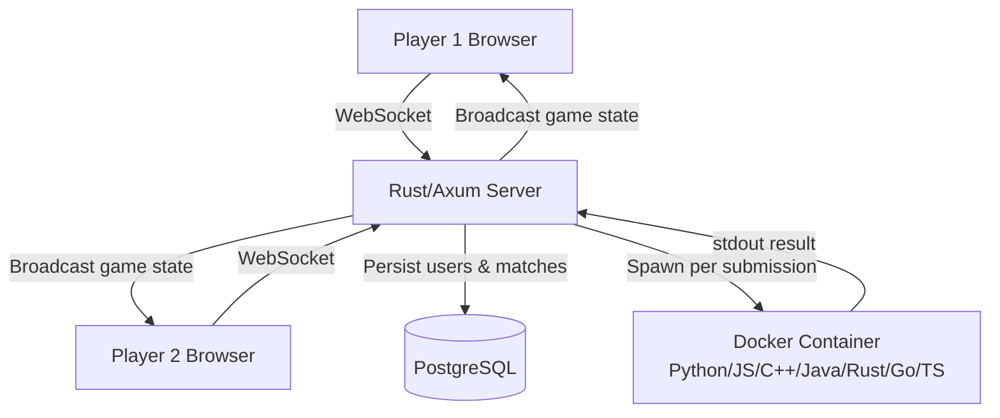

# Coding Arena

A real-time multiplayer coding platform where two players compete head-to-head to solve the same DSA problem faster. Built with Rust, Next.js, and WebSockets.

🔴 **Live:** https://arena-wheat.vercel.app

---

## How It Works

1. Player 1 creates a room and shares the invite link
2. Player 2 joins the room
3. Both players get the same coding problem simultaneously
4. 10-minute countdown begins — solve it faster and with more test cases passing to win
5. Code is executed in isolated Docker containers in real-time
6. Winner determined by accuracy + solve time score

---

## Features

- **Real-time multiplayer** — WebSocket rooms with live opponent progress tracking
- **Sandboxed execution** — code runs in isolated Docker containers across 7 languages
- **7 languages supported** — Python, JavaScript, TypeScript, C++, Java, Rust, Go
- **10 question bank** — easy/medium/hard DSA problems with automated test case judging
- **Difficulty selection** — room creator picks easy / medium / hard before game starts
- **Quick matchmaking** — join a random opponent instantly
- **JWT authentication** — register/login with secure bcrypt-hashed passwords
- **Player profiles** — track games played and win history
- **Rematch system** — both players can agree to rematch after game ends
- **Server-driven timer** — countdown synced across both clients via WebSocket ticks

---

## Tech Stack

| Layer | Technology |
|---|---|
| Backend | Rust, Axum, Tokio async runtime |
| Database | PostgreSQL via SQLx |
| Auth | JWT + bcrypt |
| Frontend | Next.js 15, TypeScript, Tailwind CSS |
| Editor | Monaco Editor (same editor as VS Code) |
| Execution | Docker containers (sandboxed, memory/CPU limited) |
| Deployment | Railway (backend), Vercel (frontend) |

---

## Architecture

## Architecture


---

## Run Locally

**Backend**
```bash
cd backend
cp .env.example .env  # add your DATABASE_URL and JWT_SECRET
cargo run
```

**Frontend**
```bash
cd frontend
npm install
npm run dev
```

Backend runs on `http://localhost:8080`
Frontend runs on `http://localhost:3000`

---

## Questions / Problems

- Sandboxed execution requires Docker to be running locally
- Set `DATABASE_URL` to a local or remote PostgreSQL instance
- Set `JWT_SECRET` to any random string

---

## Author

Built by [Kartikey Mishra](https://github.com/mkartikey598-star)